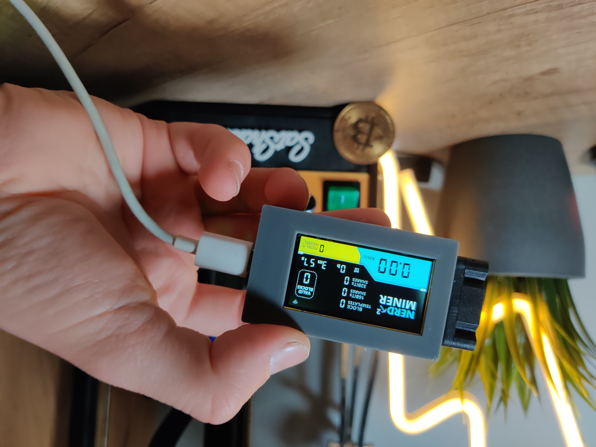

# NerdSoloMiner
**The NerdSoloMiner v2**

This is a **free and open source project** that let you try to reach a bitcoin block with a small piece of hardware. 

The main aim of this project is to let you **learn more about minery** and to have a beautiful piece of hardware in your desktop.

Original project https://github.com/valerio-vaccaro/HAN

## Requirements
- TTGO T-Display S3
- 3D BOX [here](3d_files/)

### Project description
**ESP32 implementing Stratum protocol** to mine on solo pool. Pool can be changed but originally works with ckpool.

This project is using ESP32-S3, uses WifiManager to modify miner settings and save them to SPIFF.
The microMiner comes with several screens to monitor it's working procedure and also to show you network mining stats.
Currently includes:
- NerdMiner Screen > Mining data of Nerdminer
- ClockMiner Screen > Fashion style clock miner
- GlobalStats Screen > Global minery stats and relevant data

This miner is multicore and multithreads, one thread is used to mine and other is implementing stratum work and wifi stuff. 
Every time an stratum job notification is received miner update its current work to not create stale shares. 

**IMPORTANT** Miner is not seen by all standard pools due to its low share difficulty. You can check miner work remotely using specific pools specified down or seeing logs via UART.

***Current project is still in developement and more features will be added***

## Build Tutorial
### Hardware requirements
- TTGO T-Display S3 > Buy it on aliexpress or amazon
- 3D BOX

### Flash firmware
#### microMiners Flashtool [Recommended]
Easyiest way to flash firmware. Build your own miner using the folowing firwmare flash tool:

1. Get a TTGO T-display S3
1. Go to NM2 flasher online: https://bitmaker-hub.github.io/diyflasher/

#### Standard tool
Create your own miner using the online firwmare flash tool **ESPtool** and the **binary files** that you will find in the src/bin folder.
If you want you can compile the entire project using Arduino, PlatformIO or Expressif IDF.

1. Get a TTGO T-display S3
1. Download this repository
1. Go to ESPtool online: https://espressif.github.io/esptool-js/
1. Load the firmware with the binaries from the src/bin folder.
1. Plug your board and select each file from src/bin with its address 

### Update firmware
Update NerdMiner firmware following same flashing steps but only adding 0x10000_firmware file.

#### Build troubleshooting
1. Online ESPtool works with chrome, chromium, brave
1. ESPtool recommendations: use 115200bps
1. Build errors > If during firmware download upload stops, it's recommended to enter the board in boot mode. Unplug cable, hold right bottom button and then plug cable. Try programming
1. In extreme case you can "Erase all flash" on ESPtool to clean all current configuration before uploading firmware. There has been cases that experimented Wifi failures until this was made. 

### NerdMiner configuration
After programming, you will only need to setup your Wifi and BTC address.

1. Connect to NerdMinerAP
    - AP:   NerdMinerAP
    - PASS: MineYourCoins
1. Setup your Wifi Network
1. Add your BTCaddress

Recommended low difficulty share pools:

| Pool URL                 | Port  | Web URL | Status |
|---                       |---    |---  |---      |
| public-pool.airdns.org   | 21496 | https://public-pool.airdns.org:37273/#/ | Open Source Solo Bitcoin Mining Pool supporting open source miners |
| nerdminers.org           |       | https://nerdminers.org | Team domain for future pool - Currently pointing to public-pool.airdns.org  |
| nerdminer.io             | 3333  | https://nerdminer.io | Mantained by CHMEX |

Other standard pools not compatible with low difficulty share:

| Pool URL                 | Port | Web URL |
|---                       |---   |---  | 
| solo.ckpool.org          | 3333 | https://solo.ckpool.org/ |
| btc.zsolo.bid            | 6057 | https://zsolo.bid/en/btc-solo-mining-pool |
| eu.stratum.slushpool.com | 3333 | https://braiins.com/pool |

### Buttons
With the USB-C port to the right:

**TOP BUTTON**
- One click > change screen.
- Hold 5 seconds > top right button to **reset the configurations and reboot** your NerdMiner. 
- Hold and power up > enter **configuration mode** and edit current config via Wifi. You could change your settings or verify them.

**BOTTOM BUTTON**

- One Click > turn the screen off and on again
- Double click > change orientation (default is USB-C to the right)

#### Build video

## Developers
### Project guidelines
- Current project was addapted to work with PlatformIO
- Current project works with ESP32-S3 but any ESP32 can be used.
- Partition squeme should be build as huge app
- All libraries needed shown on platform.ini

### On process
- [x]  Move project to platformIO
- [x]  Bug rectangle on screen when 1milion shares
- [x]  Bug memory leaks
- [x]  Bug Reboots when received JSON contains some null values
- [x]  Implement midstate sha256
- [x]  Bug Wificlient DNS unresolved on Wifi.h
- [x]  Code refactoring
- [x]  Add blockHeight to screen
- [x]  Add clock to show current time
- [x]  Add new screen with global mining stats
- [ ]  Add support to control BM1397

### Donations/Project contributions
If you would like to contribute and help dev team with this project you can send a donation to the following LN address ⚡teamnerdminer@getalby.com⚡

Enjoy
