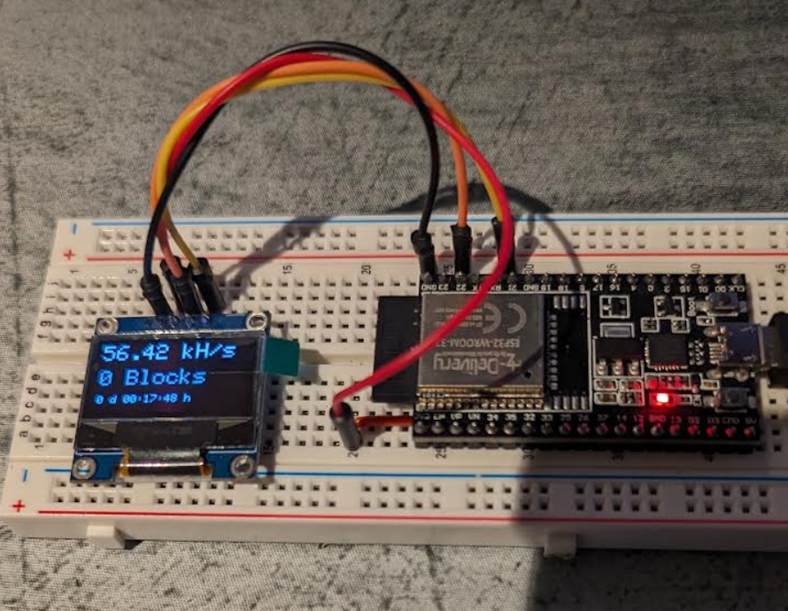
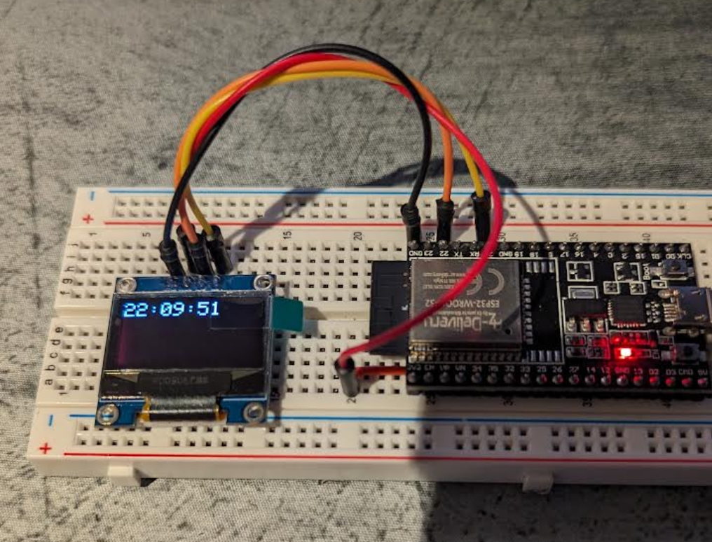

# Pinout ESP32 Devkit C -> SSD1306

| SSD1306 Display   | ESP32 devkit C|
| ----------------- | ------------- | 
| GND               | GND           | 
| VCC               | 3.3V          | 
| SCL               | GPIO 22       |
| SDA               | GPIO 21       |

## Button configuration

Boot button is connected to GPIO 0

Single click on "boot" button: switch between time and hashrate

Double click on "boot" button: rotate screen 180°

## Build information

In Platformio, select ENV "ESP32_SSD1306" to build and flash

